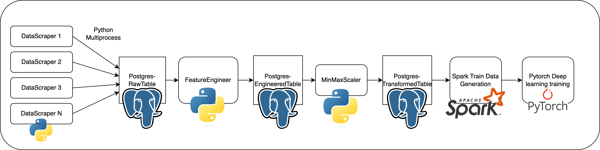

# Deep Learning for Stock Prediction

This repository is dedicated to a deep learning project focused on predicting stock prices. It encompasses the entire process from data scraping and manipulation to the application of advanced deep learning models. The project's goal is to explore and evaluate the effectiveness of various neural network architectures in forecasting stock market trends.

## Note: This project is still under construction. 

## Research Paper 

[Paper](./paper.pdf)

## Project architecture



### Tools and Libraries

The project utilizes several tools and libraries, primarily focused on Python and PyTorch:

1. **Python**: A versatile programming language used for data scraping, data manipulation, and model implementation.
   - Utilizes multiprocessing for efficient data handling.
2. **PyTorch**: A powerful deep learning framework that facilitates the construction and training of neural network models.
3. **Spark**: Big data analystics tool

## Project descriptions 

### Data Scraping

We scrape the high-frequency data with one-minute interval about the S&P 500 ETF from [polygen](https://polygon.io/) within one year. 

### Feature Engineering

1. We generate the features with a $15$ minute window rolling mean and standard deviation of current features.
2. We perform the `minmax scaler` on the data to make sure the gradient will not explode in the gradient descent steps

### Data Transformation

To generate the training data, we use spark to perform distributed data generation with output corresponds to following feature with order:

1. `n_transactions_std15`: the number of transactions with 15 min standard deviation
2. `low_price_std15`: the low price standard 15 mins  
3. `high_price_std15`
4. `curr_price_std15`
5. `volume_std15`
6. `n_transactions_avg15`
7. `volume_avg15`
8. `rsi_value`
9. `macd_hist`
10. `macd_sig`
11. `macd_val`
12. `ema_value`
13. `sma_value`
14. `n_transactions`
15. `low_price`
16. `high_price`
17. `curr_price`
18. `volume`

### Deep learning models 

TODO

<<<<<<< HEAD
## Project Usage

### Installment

TODO

### Basic Usage

#### Initialize the Database system
=======
## Run the project
>>>>>>> 75a2367b5038551905a64d6067c91dafa7a510c4

### TODO: Change this

```shell
python DataScraper.py --start_date 2023-01-01 --end_date 2024-03-15 --api api_key
```

## License

This project is open-sourced under the MIT license.
